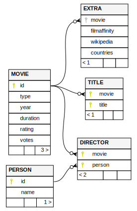

Crea una base de datos de películas a partir de los datos de [IMDb](https://datasets.imdbws.com) y [Wikidata](https://www.wikidata.org/wiki/Wikidata:Main_Page).

Puedes descargar los [resultados aquí](https://s-nt-s.github.io/imdb-sql/imdb.tar.gz)
y el [log de la última ejecución aquí](https://s-nt-s.github.io/imdb-sql/execution.log).

